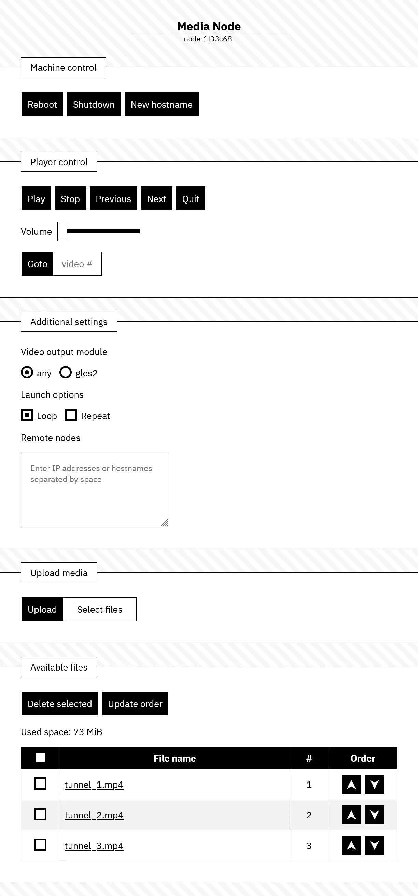

# RPi Media Node

Image for *Raspberry Pi 4* based on Debian 10 (buster), which allows using Raspberry Pi in kiosk mode to play video and audio files.

# Usage
1. Go to [releases section](https://github.com/evgenii-d/rpi-media-node/releases)
2. Download the `.7z` file
3. Extract image and flash SD using [etcher](https://www.balena.io/etcher/) or similar software
4. Raspberry Pi must be connected to the network via cable

After that, Raspberry Pi can be found on the network either by IP address (DHCP) or via mdns (zeroconf).
<br>
Web app port - 5000. Should be something like this:
* IP - http://192.168.1.201:5000/
* zeroconf - http://node-1f33c68f.local:5000/
<br>

# Features
* By default you can upload `.mp4`, `.webm`, `.mkv`, `.mp3` and `.wav` files.
* Videos encoded with *H.265* codec are *preferred*. In this case Raspberry Pi 4 can handle videos in 4k (3840x2160) 60fps.
* If you want to use both micro HDMI ports (mirror mode), then 
  * encode videos with *H.264* (only FullHD video supported)
  * check `gles2` in *Additional settings* section
  * reboot node
* Audio output is available via 3.5mm jack

# API

## Info
|Method|HTTP request|Notes|
|---|---|---|
|GET|/info/name|media node name|
|POST|/info/name|plain text, max char 20|

## Machine control
|Method|HTTP request|Notes|
|---|---|---|
|GET|/machine-control/shutdown|shutdown node|
|GET|/machine-control/reboot|reboot node|
|GET|/machine-control/hostname|generate new hostname, reboot required|

## Player settings
|Method|HTTP request|Notes|Example|
|---|---|---|---|
|GET|/player-settings/volume|current volume level||
|GET|/player-settings/module|-L — repeat all <br> -R — repeat current item||
|GET|/player-settings/options|video output mode <br> any — automatic <br> gles2 — OpenGL extension||
|GET|/player-settings/remote-nodes|list of IP addresses||
|POST|/player-settings/volume| 0-320, |```{ "value": 100 }```|
|POST|/player-settings/module|empty; -L, -R|```{ "value": ["-L", "-R"] }```|
|POST|/player-settings/options|any or gles2|```{ "value": "gles2" }```|
|POST|/player-settings/remote-nodes||```{ "value": ["192.168.1.135:5000", "192.168.1.67:5000"] }```|

## Playlist
|Method|HTTP request|Notes|
|---|---|---|
|GET|/playlist|list of media files in playlist|
|GET|/playlist?command=play|play media file|
|GET|/playlist?command=stop|stop playing media file|
|GET|/playlist?command=prev|play previous media file in playlist|
|GET|/playlist?command=next|play next media file in playlist|
|GET|/playlist?command=quit|shutdown player|
|GET|/playlist?command=goto&value=|goto item at index|
|POST|/playlist|update playlist oreder|

## Media files
|Method|HTTP request|Notes|
|---|---|---|
|POST|/media|upload media files|
|DELETE|/media|remove media files|

# Web app overview

